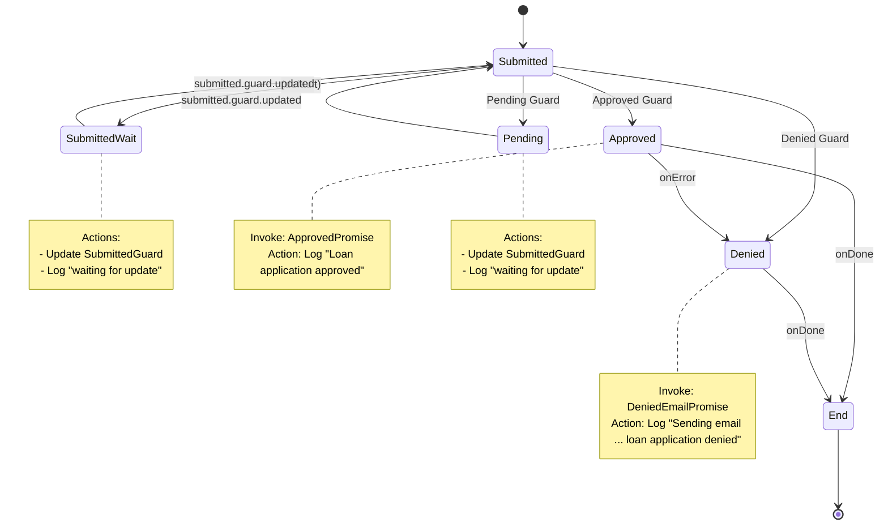

# Loan Application Workflow

```
npm install
npm start
```

- [`main.ts`](./main.ts): setup and execute the workflow and evaluator
- [`evaluator.ts`](./evaluator.ts): ruleset evaluator for the `Submitted` state of the workflow
- [`workflow.ts`](./workflow.ts): state machine definition for a loan application workflow
- [`ruleset.json`](./ruleset.json): ruleset definition for the `Submitted` state of the workflow

This example demonstrates how to [configure](./evaluator.ts) a Ruleset Evaluator as a [Transition Actor](https://stately.ai/docs/transition-actors).

Such a setup can be useful for [guarding](https://stately.ai/docs/guards) [transitions](https://stately.ai/docs/transitions) from a particular [state](https://stately.ai/docs/states) in a [state machine](https://stately.ai/docs/machines), where the transition is only allowed if an evaluation result matches a certain condition.

This example demonstrates how we can use such an actor to transition a state machine for a loan application workflow based on updated results from the evaluator as new evaluation criteria are received.

---


