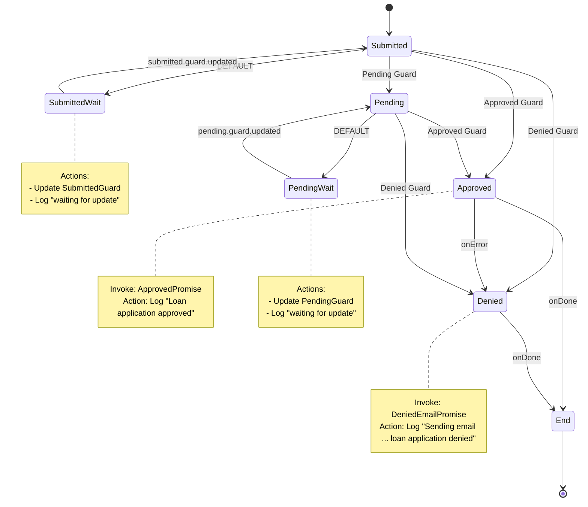

# Loan Application Workflow

```
npm install
npm start
```

- [`main.ts`](./main.ts): setup and execute the workflow and guard evaluators
- [`workflow.ts`](./workflow.ts): state machine definition for a loan application workflow
- `guards/submitted/`
  - [`evaluator.ts`](./guards/submitted/evaluator.ts): ruleset guard evaluator (or "transition actor") for the `Submitted` state of the workflow
  - [`ruleset.json`](./guards/submitted/ruleset.json): ruleset used by the evaluator
- `guards/pending/`
  - [`evaluator.ts`](./guards/pending/evaluator.ts): ruleset guard evaluator (or "transition actor") for the `Pending` state of the workflow
  - [`ruleset.json`](./guards/pending/ruleset.json): ruleset used by the evaluator

This example demonstrates how to configure a Ruleset Evaluator as a [Transition Actor](https://stately.ai/docs/transition-actors).

Such a setup is useful for [guarding](https://stately.ai/docs/guards) [transitions](https://stately.ai/docs/transitions) from a particular [state](https://stately.ai/docs/states) in a [state machine](https://stately.ai/docs/machines), where the transition is only allowed if an evaluation result matches a certain condition.

This example demonstrates how we can use such actors to transition a state machine for a loan application workflow based on updated results from the guard evaluators as new evaluation criteria are received.

---


